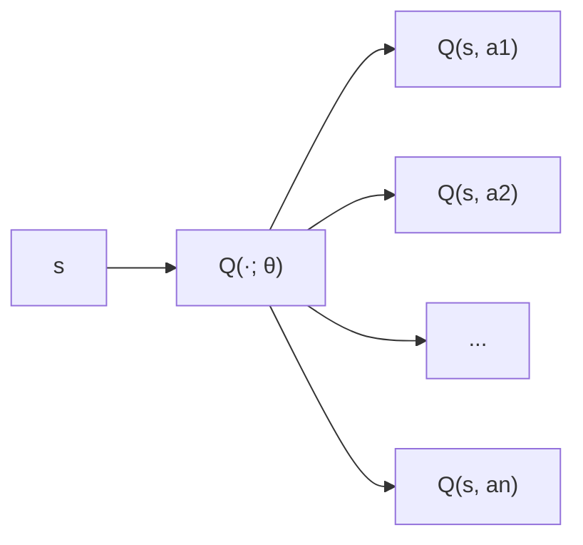

---
# You can also start simply with 'default'
theme: seriph
# random image from a curated Unsplash collection by Anthony
# like them? see https://unsplash.com/collections/94734566/slidev
background: https://images.unsplash.com/photo-1583074890416-7fd25dbafbdf?q=100&w=1920&auto=format&fit=crop
# some information about your slides (markdown enabled)
title: Deep Q-Network (DQN) y Double DQN
# apply unocss classes to the current slide
class: text-center
# https://sli.dev/features/drawing
drawings:
  persist: false
# slide transition: https://sli.dev/guide/animations.html#slide-transitions
transition: slide-left
# enable MDC Syntax: https://sli.dev/features/mdc
mdc: true
---

# Deep Q-Network (DQN) y Double DQN

Playing Atari Games with Deep Reinforcement Learning

<div class="abs-br m-6 text-xl">
  <a href="https://arxiv.org/abs/1312.5602" target="_blank" class="slidev-icon-btn">
    <academicons:arxiv-square/>
  </a>
  <a href="https://arxiv.org/abs/1509.06461" target="_blank" class="slidev-icon-btn">
    <academicons:arxiv-square/>
  </a>
</div>

---
layout: image-right
image: https://ale.farama.org/_images/breakout.gif
---

# Introducción

- Aprendizaje por refuerzo profundo aplicado a juegos Atari.
- Llegando a superar a humanos en varios juegos.
- Misma arquitectura y entrenamiento para diferentes juegos.
- Input: imagen de 210x160x3 píxeles (frames).
- Ejemplo recurrente en esta presentación: **Breakout** (la pelota rompe ladrillos).

---

# ¿Por qué DQN?

<v-clicks>

- Ya conocen Q-learning: la tabla $Q(s,a)$ no escala a imágenes (entradas de alta dimensión).
- Necesidad de **generalización** entre estados parecidos.
- Combinar Q-learning con redes profundas trae problemas de estabilidad — ya lo vamos a ver.

</v-clicks>

<v-click>

<div class="flex justify-around items-start gap-8 mt-4">

<div class="text-center">

**Q-tabla**

| (s, a)   | Q(s,a) |
|----------|-------:|
| (s₁, a₁) |   2.4  |
| (s₁, a₂) |  -0.1  |
| (s₂, a₁) |   0.5  |
| (s₂, a₂) |   1.3  |
| ...      |  ...   |

</div>

<div class="text-center">

**Q-red parametrizada**



</div>

</div>

</v-click>

---

# De Q-Tabular a Q-Función Parametrizada

- **Q-Función parametrizada**
Sustituimos la tabla por una red con parámetros $\theta$:
$$Q(s,a)\;\approx\;Q(s,a;\theta)$$

- **Actualización en Q-Learning tabular**
$$Q(s,a)\;\leftarrow\;Q(s,a)\;+\;\alpha\;\bigl[r + \gamma\,\max_{a'}Q(s',a') - Q(s,a)\bigr]$$

- **Actualización en DQN (paper 2013)**
$$\mathcal{L}(\theta)\;=\;\mathbb{E}_{s,a,r,s'}\Bigl[\bigl(r + \gamma\,\max_{a'}Q(s',a';\theta)\;-\;Q(s,a;\theta)\bigr)^2\Bigr]$$

---

# ¿Qué rompe al combinar Q-learning + redes?

<v-clicks>

- **Problema 1 — Muestras correlacionadas.** Steps consecutivos son casi idénticos → la red sobreajusta a la trayectoria reciente.

  *Ej.: en Breakout, 50 frames seguidos la pelota viaja en zona vacía — input casi idéntico, acción `NOOP`, reward 0. La red aprende "no hacer nada" y olvida cómo golpear la pelota.*

- **Problema 2 — Target no estacionario.** $y = r + \gamma \max_{a'} Q(s', a'; \theta)$ depende de $\theta$, que cambia en cada update. Persiguen un blanco que se mueve.

  *Ej.: cada update modifica $\theta$ → cambia $Q(s', \cdot; \theta)$ → cambia el target $y$ del próximo update. Feedback loop, diverge fácil.*

</v-clicks>

<v-click>

<div class="mt-6 text-center text-lg">
DQN ataca el problema 1 con <strong>Replay Memory</strong> y mitiga el problema 2 con <code>.detach()</code>.<br>
La solución completa al problema 2 la vemos en la Parte 2.
</div>

</v-click>

---
layout: two-cols
---

# Replay Memory

<ul class="text-left mx-auto max-w-lg text-sm">
  <li v-click class="mb-1">
    <strong>¿Por qué?</strong> Rompe la correlación temporal de las muestras (problema 1) y reutiliza experiencias.
  </li>
  <li v-click class="mb-1">
    <strong>¿Qué guarda?</strong> Tuplas <code>(state, action, reward, terminated, next_state)</code>.
    <span class="text-xs italic block opacity-70 mt-1">Guardamos <code>terminated</code>, no <code>done</code>: si se corta por time limit (<code>truncated</code>), el MDP sigue activo.</span>
  </li>
  <li v-click class="mb-1">
    <strong>Buffer circular.</strong> Cuando está lleno, sobrescribe las experiencias más antiguas.
  </li>
  <li v-click class="mb-1">
    <strong>¿Cuándo se usa?</strong> Antes de cada update: muestreo aleatorio de un minibatch para entrenar la red.
  </li>
</ul>

::right::

```python
# Insertar una experiencia en la memoria
memory.add(state, action, reward, terminated, next_state)

# Durante cada paso de entrenamiento:
if len(memory) > batch_size:
    # Muestreamos un minibatch aleatorio
    batch = memory.sample(batch_size)
    # Entrenamos la red con ese batch
    agent.update_weights(batch)
```

---

# Loss y `.detach()` — mitigando el problema 2

<v-clicks>

- Recordemos la loss del TD-error (paper 2013):
$$\mathcal{L}(\theta)\;=\;\bigl(\underbrace{r + \gamma\,\max_{a'}Q(s',a';\theta)}_{\text{target}\;y}\;-\;Q(s,a;\theta)\bigr)^2$$

- **Trampa:** el mismo $\theta$ aparece en target y predicción. Si dejamos fluir el gradiente por ambos lados, el gradiente "contamina" el target *dentro* del propio update.

- **Fix:** tratar el target como una constante. En PyTorch: `torch.no_grad()` al computarlo (o `.detach()` después).

</v-clicks>

<v-click>

Esto resuelve el problema 2 *dentro* de un step. Entre steps el target sigue moviéndose porque $\theta$ cambia. La solución completa (**target network**) la vemos en la Parte 2.

</v-click>

---

# Otros trucos del paper

<v-clicks>

- **Frame skipping ($k = 4$).**
  El agente solo "ve" cada 4° frame y la acción se repite los 4 frames intermedios.
  - Más eficiente computacionalmente (1/4 de forward passes).
  - Suficiente para Atari: las acciones tienen efecto a escala de varios frames.

- **Reward clipping.**
  Los rewards se mapean a $\{-1, 0, +1\}$. Se pierde magnitud pero se gana comparabilidad entre juegos.
  - Permite usar **los mismos hiperparámetros** para Breakout, Pong, Space Invaders, etc.
  - Sin esto, juegos con scores grandes (ej. Asteroids) dominarían los gradientes.

- **Stack de 4 frames como input.**
  Una sola imagen no contiene velocidad ni dirección. El stack le da a la red acceso temporal sin tener que ser recurrente.

</v-clicks>

---
clicks: 5
---

# Preprocesamiento de Imagen - Paso a Paso

<v-switch>

  <template #1>
    <div class="text-center">
      
      <p class="mt-4">1. Imagen original (210x160 RGB)</p>
    </div>
  </template>

  <template #2>
    <div class="text-center">
      
      <p class="mt-4">2. Convertido a escala de grises</p>
    </div>
  </template>

  <template #3>
    <div class="text-center">
      
      <p class="mt-4">3. Redimensionado a 110x84</p>
    </div>
  </template>

  <template #4>
    <div class="text-center">
      
      <p class="mt-4">4. Recortado final (84x84)</p>
    </div>
  </template>

  <template #5>
    <div class="text-center">
      
      <p class="mt-4">5. Stack de frames (4x84x84)</p>
    </div>
  </template>

</v-switch>

---

# Arquitectura de la CNN en DQN

- Entrada: tensor de $84 \times 84 \times 4$.
- Capas convolucionales para extraer características espaciales.
- Capas completamente conectadas para estimar valores Q.
- Salida: vector de tamaño $|A|$ (número de acciones posibles).

<v-click>
  <div class="flex flex-col items-center mt-2">
    
  </div>
</v-click>

---

# Algoritmo DQN

<div class="flex flex-col items-center">
  
</div>

---

# El paper 2013 vs Nature 2015

Nosotros seguimos la versión **2013** (la que define DQN).

<br>

| Aspecto              | DQN 2013 (la nuestra)    | Nature 2015              |
|----------------------|--------------------------|--------------------------|
| Loss                 | MSE                      | Huber (SmoothL1)         |
| Optimizador          | RMSProp                  | RMSProp                  |
| Target network       | **No** (usa `.detach()`) | **Sí** ($\theta^-$)      |
| Gradient clipping    | No                       | Sí                       |
| Juegos evaluados     | 7                        | 49                       |

<br>

<v-click>

La **target network** que aparece en Nature 2015 la van a ver en la Parte 2 — es uno de los dos cambios que define DDQN.

</v-click>

---

# Hiperparámetros (paper original)

<v-clicks>

- Entrenamiento de 50M de pasos.
- $\epsilon$ con decrecimiento lineal: 1 → 0.1 durante el primer millón de pasos.
- $\gamma = 0.99$.
- Replay memory de 1M de transiciones.
- Batch size de 32.
- Frame skipping $k = 4$, stack de 4 frames.

</v-clicks>

---

# Resultados DQN

<v-clicks>

- **Misma red, mismos hiperparámetros** para 49 juegos Atari distintos.
- **Superior al humano** en **29 de 49** juegos.
- En **Breakout**: ~1300% del nivel humano. En **Pong, Space Invaders**: nivel experto.
- Aprende políticas no triviales: en Breakout descubre que conviene **abrir un túnel lateral** y meter la pelota por arriba para limpiar la pantalla de un golpe.

</v-clicks>

---
layout: section
---

# Parte 2

## DQN sobreestima, y arreglarlo cuesta una línea

---

# Recap rápido: DQN

<v-clicks>

- Aproxima $Q(s,a)$ con una CNN sobre 4 frames preprocesados.
- **Replay memory**: rompe correlación temporal.
- TD-error MSE con `target.detach()`: el gradiente solo modifica la predicción.
- ε-greedy con anneal, RMSProp, frame skip + reward clip.

</v-clicks>

<v-click>

Hoy: dos limitaciones que arrastrábamos y cómo **DDQN** las arregla.

</v-click>

---

# ¿Qué le falta a DQN?

<v-clicks>

- **Limitación 1 — el target sigue moviéndose entre steps.**
  `.detach()` evita que el gradiente fluya por el target *dentro* de un step, pero $\theta$ cambia en cada update → el target del próximo step ya es distinto. Inestabilidad acumulada.

- **Limitación 2 — sobreestimación.**
  El target usa $\max_{a'} Q(s', a';\theta)$. Cuando $Q$ es ruidoso, el $\max$ sesga el target hacia arriba. Esto no lo arregla `.detach()`.

</v-clicks>

<v-click>

**DDQN arregla las dos.** Dos cambios sobre DQN:

1. **Target network** ($\theta^-$) — segunda copia de la red, congelada.
2. **Regla del target** — separa selección y evaluación.

</v-click>

---

# Cambio 1 — Target Network

<v-clicks>

- DDQN mantiene **dos copias** de la red:
  - $\theta$ (**online**): se entrena con gradiente en cada step.
  - $\theta^-$ (**target**): congelada, no recibe gradiente.

- El target del TD-error se calcula con $\theta^-$:
$$y \;=\; r + \gamma\,\max_{a'} Q(s', a';\theta^-)$$

- Cada $C$ pasos se sincroniza: $\theta^- \leftarrow \theta$ ($C = 10\,000$ en el paper).

- El blanco deja de moverse en cada step → entrenamiento mucho más estable. **Limitación 1 resuelta.**

</v-clicks>

<v-click>

Este cambio solo (sin tocar la regla del target) sería la "DQN versión Nature 2015". DDQN agrega además el cambio en la regla.

</v-click>

---

# El problema: sobreestimación

<v-clicks>

- El target usa $\max_{a'} Q(s', a';\,\cdot\,)$.
- Recuerden: **Q-learning vs SARSA**. SARSA usa la acción real del próximo paso; Q-learning usa el $\max$.
  El $\max$ es el que rompe.
- **Intuición:** el $\max$ sobre estimadores ruidosos sesga el target **hacia arriba**:
$$\mathbb{E}\!\left[\max_a \hat{Q}(s, a)\right]\;\geq\;\max_a \mathbb{E}\!\left[\hat{Q}(s, a)\right]$$
- Con redes profundas el ruido en $\hat{Q}$ es grande → el sesgo se amplifica → el agente aprende Q-values inflados y elige acciones que no son las óptimas.

</v-clicks>

---

# Arquitectura DDQN

<div class="flex justify-center items-center mt-4">
  
</div>

---

# Cambio 2 — Regla del target

**Idea:** separar *quién elige la acción* de *quién la evalúa*.

<v-clicks>

- Con solo target network (Nature 2015):
$$y\;=\;r + \gamma\,\max_{a'} Q(s', a';\theta^-) \;=\; r + \gamma\,Q\!\bigl(s',\;\arg\max_{a'} Q(s', a';\theta^-);\;\theta^-\bigr)$$

- Double DQN:
$$y^{\text{DDQN}}\;=\;r + \gamma\,Q\!\bigl(s',\;\arg\max_{a'} Q(s', a';\;\theta);\;\theta^-\bigr)$$

- El $\arg\max$ se hace con la red **online** ($\theta$); la **evaluación** con la **target** ($\theta^-$).
- Si la online sobreestima una acción rara, la target probablemente no lo haga sobre esa misma acción → el sesgo se cancela. **Limitación 2 resuelta.**

</v-clicks>

<v-click>

Costo de implementación: **una línea distinta** en el cálculo del target. Misma arquitectura, mismos hiperparámetros.

</v-click>

---

# Resultados DDQN

<v-clicks>

- Los Q-values aprendidos son **más cercanos a los reales** (figuras del paper de van Hasselt).
- Supera a DQN en la **mayoría** de los 49 juegos Atari.
- Sin agregar parámetros, sin más cómputo, sin nuevos hiperparámetros.
- La gráfica clásica: DQN diverge hacia Q-values inflados durante el entrenamiento; DDQN se mantiene cerca del valor verdadero.

</v-clicks>

---

# Cierre

<v-clicks>

- **DQN** (2013): primer trabajo que combina Q-learning con CNNs de forma estable, vía replay memory y `.detach()`.
- **DDQN** (2015): agrega target network + cambio en la regla del target. Reduce la sobreestimación.
- Cambio mínimo en código, ganancia consistente en performance.
- Después vinieron Dueling DQN, Prioritized Experience Replay, Rainbow, Distributional RL, etc.

</v-clicks>

<v-click>

**Papers:**

- Mnih et al. 2013 — *Playing Atari with Deep Reinforcement Learning* — [arxiv.org/abs/1312.5602](https://arxiv.org/abs/1312.5602)
- Mnih et al. 2015 — *Human-level control through deep reinforcement learning* — [nature.com/articles/nature14236](https://www.nature.com/articles/nature14236)
- van Hasselt et al. 2015 — *Deep Reinforcement Learning with Double Q-learning* — [arxiv.org/abs/1509.06461](https://arxiv.org/abs/1509.06461)

</v-click>
